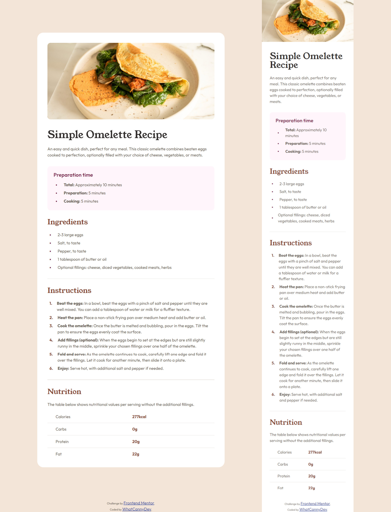

# Frontend Mentor - Recipe page solution

This is a solution to the [Recipe page challenge on Frontend Mentor](https://www.frontendmentor.io/challenges/recipe-page-KiTsR8QQKm). Frontend Mentor challenges help you improve your coding skills by building realistic projects. 

## Table of contents

- [Overview](#overview)
  - [The challenge](#the-challenge)
  - [Screenshot](#screenshot)
  - [Links](#links)
- [My process](#my-process)
  - [Built with](#built-with)
  - [What I learned](#what-i-learned)
  - [Continued development](#continued-development)
- [Author](#author)

## Overview

### The challenge

Your challenge is to build out this recipe page and get it looking as close to the design as possible.

You can use any tools you like to help you complete the challenge. So if you've got something you'd like to practice, feel free to give it a go.

Want some support on the challenge? [Join our community](https://www.frontendmentor.io/community) and ask questions in the **#help** channel.

### Screenshot



### Links

- Solution Repository URL: [Add solution URL here](https://github.com/CannyRo/FrontendMentor_RecipePage_KiTsR8QQKm)
- Live Site URL: [Add live site URL here](https://cannyro.github.io/FrontendMentor_RecipePage_KiTsR8QQKm/)

## My process

### Built with

- Semantic HTML5 markup
- CSS custom properties
- Flexbox
- Mobile-first workflow

### What I learned

I've learned that in some cases, the semantic approach with Html tags closer to the design reality is not necessarily adapted to the styles to be applied. such as for stylizing <hr/> tags and list bullet points (::marker).

Instead of <hr/> I finally used simple stylized <div>.

```html
<div class="hr"></div>
```
```css
.hr {
  width: 100%;
  height: 1px;
  background-color: hsl(30, 18%, 87%);
}
```

Instead of styling li::marker on list bullet points I finally used a none styling list and some <span>
```html
<ul>
  <li>
    <span class="bullet">●</span>
    <div class="list_content">2-3 large eggs</div>
  </li>
  ...
  
</ul>
```
```css
ul, ol{
    list-style: none;
}
li{
    display: flex;
    align-items: center;
    margin-bottom: 8px;
    padding-left: 8px;
}
.bullet{
    width: 16px;
    font-size: 8px;
    margin-right: 16px;
    color: hsl(332, 51%, 32%);
}
```

### Continued development

I still have a lot to do, especially in terms of speed of execution. I'd also like to focus on the BEM method for writing my CSS.

## Author

- Website - [WhatCannyDev is searching a work-study contract in France](https://cannyro.github.io/hire_mr_canny/en)
- Frontend Mentor - [@CannyRo](https://www.frontendmentor.io/profile/CannyRo)
- GitHub - [@CannyRo](https://github.com/CannyRo)
- LinkedIn - [Ronan CANNY](https://www.linkedin.com/in/ronan-canny-b29443277/)

